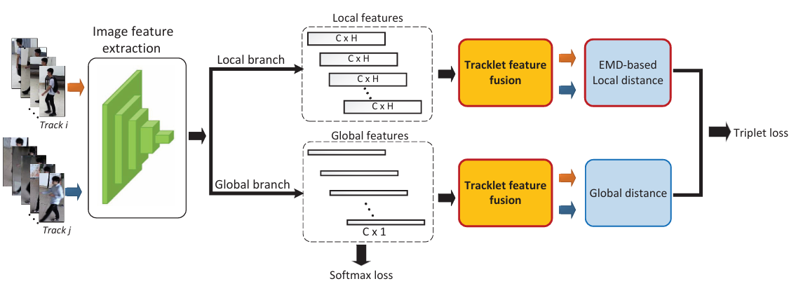

# EMD-based Local Matching for Occluded Person Re-identification

This repository contains the implementation of **EMD-based local matching for occluded Person Re-identification**, as presented in our paper published in *Machine Learning with Applications*. The proposed method introduces a multiple-shot approach for Person Re-ID by integrating **feature fusion** and **Earth Mover’s Distance (EMD)-based local matching**.

## 📜 Paper
**Title:** EMD-based Local Matching for Occluded Person Re-identification  
**Authors:** Hoang-Anh Nguyen, Thuy-Binh Nguyen, Hong-Quan Nguyen, Thi-Lan Le  
**Journal:** Machine Learning with Applications  

📄 [Read the Paper](#) (*Add link when available*)

## 🔥 Highlights
- **Multi-shot Person Re-ID:** Our framework extends single-shot Re-ID to a multiple-shot scenario by utilizing tracklet-based feature fusion.
- **Tracklet Matching Approach:** Person Re-ID is formulated as a **pedestrian tracklet matching problem**, where tracklets are generated via human detection and tracking.
- **Occlusion Handling:** The proposed framework tackles occlusions by incorporating **EMD-based local matching**.
- **Ablation Study:** The effectiveness of **feature fusion** is investigated to demonstrate its impact on Re-ID performance.

## 🚀 Methodology
The proposed method follows a **three-step** pipeline:

1. **Feature Extraction**  
   - Each pedestrian tracklet is processed using **ResNet-50** to extract global and local features.
   
2. **Feature Fusion**  
   - **Average pooling** is applied to enhance person representation from multiple frames.

3. **Matching using EMD**  
   - **Global matching:** Euclidean distance.  
   - **Local matching:** Earth Mover’s Distance (EMD) for optimal alignment of local features.

The model is trained using **identity loss** and **triplet loss** for robust feature learning.

 (*Add a relevant image or diagram from the paper*)

## 📊 Dataset
We conduct experiments on the **FAPR dataset**, which consists of pedestrian tracklets automatically extracted from videos captured by two non-overlapping cameras. Additionally, we evaluate the method on standard benchmarks like **VIPeR** and **Market-1501-Partial**.

## 📊 Results
### Single shot
### Table 1: Performance Comparison on VIPeR, Market-1501-Partial, and FAPR datasets
| Method \ Matching rates | VIPeR (R-1) | VIPeR (R-5) | VIPeR (R-10) | Market-1501-Partial (R-1) | Market-1501-Partial (R-5) | Market-1501-Partial (R-10) | FAPR (R-1) | FAPR (R-5) | FAPR (R-10) |
|----------------------|------------|------------|------------|----------------------|----------------------|----------------------|------------|------------|------------|
| Global (DMLI) | 37.8 | 68.2 | 79.9 | 68.6 | 83.2 | 87.6 | 58.0 | 88.0 | 92.0 |
| Global (EMD) | 38.3 | 67.8 | 79.7 | 74.7 | 87.2 | 91.2 | 60.2 | 89.4 | 95.1 |
| Local (DMLI) | 40.2 | 73.1 | 83.6 | 77.3 | 89.4 | 92.1 | 59.4 | 87.4 | 91.8 |
| Local (EMD) | 47.8 | 76.3 | **86.7** | 78.0 | **89.5** | 92.6 | 64.6 | **91.5** | **97.0** |
| Global+Local (DMLI) | 40.9 | 72.8 | 82.9 | 77.2 | 89.3 | 92.5 | 61.3 | 86.5 | 91.6 |
| Global+Local (EMD) | **47.8** | **76.6** | 86.5 | **78.0** | 89.1 | **92.6** | **65.8** | 89.4 | 95.8 |

### Multi shot
### Table 2: Performance Comparison on FAPR Dataset
| Probe | Gallery | Baseline | Average |
|-------|---------|----------|---------|
| 20191104 indoor_left | outdoor_left | 55.3 | **100** |
| 20191104 indoor_right | outdoor_right | 64.3 | **76.3** |
| 20191104 indoor_cross | outdoor_cross | 45.5 | **100** |
| 20191104 indoor_all | outdoor_all | 58.8 | **82.3** |
| 20191105 indoor_left | outdoor_left | 100.0 | **100** |
| 20191105 indoor_right | outdoor_right | 75.0 | **98.8** |
| 20191105 indoor_cross | outdoor_cross | 57.1 | **98.9** |
| 20191105 indoor_all | outdoor_all | 78.6 | **100** |

## 🔧 Installation

```bash
git clone https://github.com/your-repo/emd-person-reid.git
cd emd-person-reid
pip install -r requirements.txt
```

## 📂 Dataset Preparation
1. Download the **FAPR dataset** from [link](#).
2. Extract the dataset and place it in the `data/` directory.

```
data/
├── FAPR/
│   ├── query/
│   ├── gallery/
```

## 🏋️‍♂️ Training

Train the model using the following command:

```bash
python train_alignedreid_multi.py --dataset FAPR --epochs 100 --batch_size 32
```

## 📈 Evaluation

To evaluate the trained model:

```bash
python train_alignedreid_multi.py --dataset FAPR --checkpoint path/to/model.pth
```

## 🔗 Citation
If you use this work, please cite:

```bibtex
@article{nguyen2024emd,
  title={EMD-based Local Matching for Occluded Person Re-identification},
  author={Nguyen, Hoang-Anh and Nguyen, Thuy-Binh and Nguyen, Hong-Quan and Le, Thi-Lan},
  journal={Machine Learning with Applications},
  year={2024}
}
```

## 📬 Contact
For any questions or collaborations, please contact **[nguyenhoanganht3@gmail.com]**.

